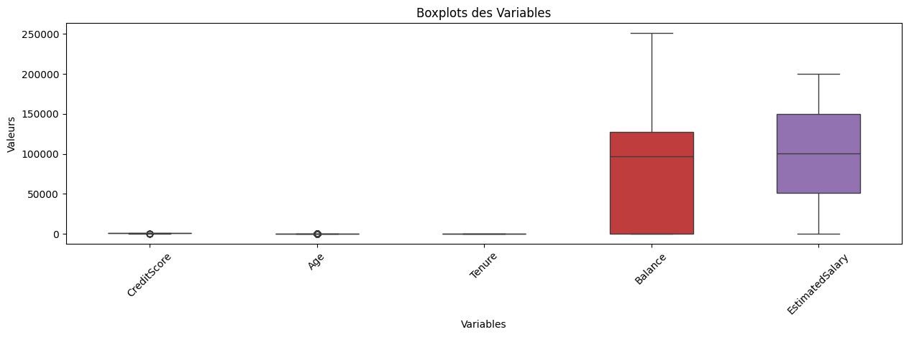
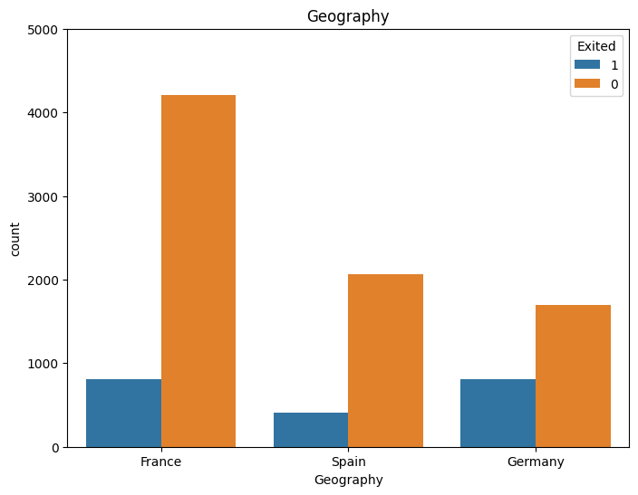
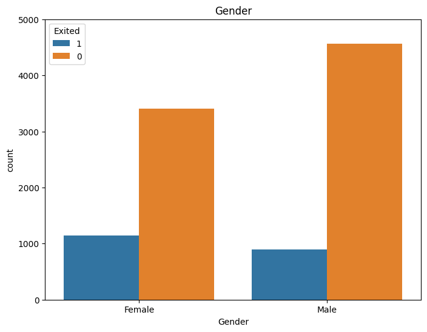
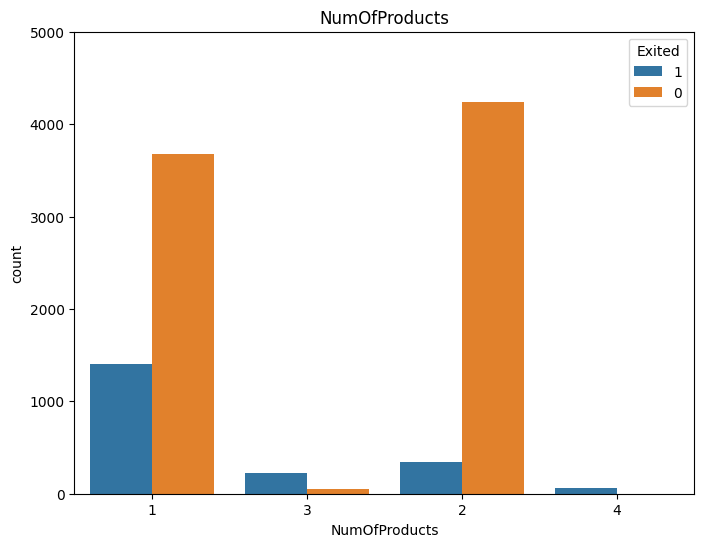
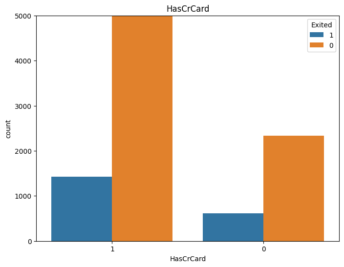
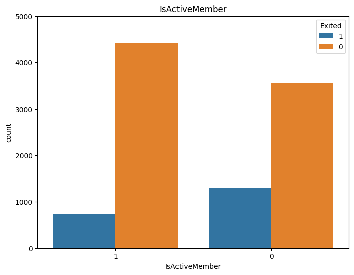
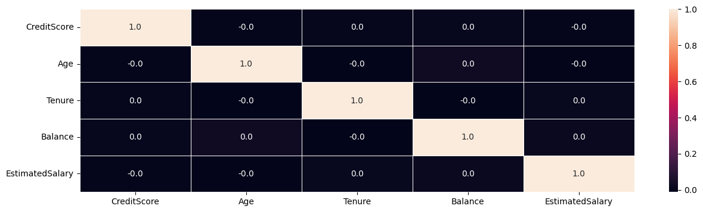
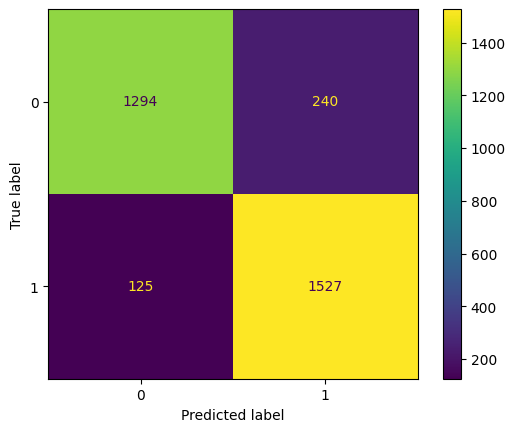
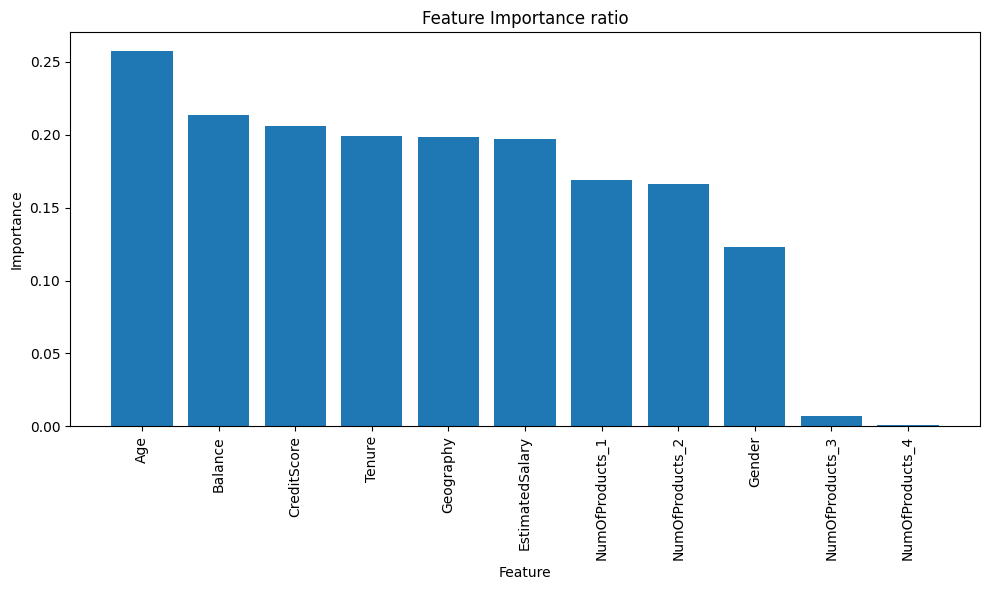

# Modélisation du phénomène de churn d'une banque
# I. Introduction
Le taux d'attrition (ou churn) désigne le pourcentage de clients perdus par une entreprise dans notre cas une banque, par rapport au nombre total de clients sur une période donnée. Les motifs d'attrition peuvent se caractériser par une baisse du besoin, une perte d'intérêt pour le produit ou le service proposé, une meilleure offre chez un concurrent ou une augmentation des prix.

Dans cette étude nous allons travailler sur un problème de classification dans lequel nous avons un ensemble de données où se trouve les détails des clients d'une banque et la variable cible est une variable binaire reflétant le fait que le client ait quitté la banque (fermé son compte) ou il continue d'être client. La base de données a été téchargée sur le site Kaggle.

Pour ce faire, nous allons dans un premier temps faire une étude exploratoire de la base des données enfin de determiner l'ensemble des caractéristiques de nos données. Puis dans la deuxième partie nous allons mettre en place quatre méthodes SVM afin de modéliser le phénomène de churn afin choisir le meilleur modèle qui prédit le churn en utilisant un certain nombre de critère de mesure. La dernière étape sera consacrée à l'implémentation d'une méthode ANN pour modéliser le phenomène de churn et enfin nous allons terminé par une conclusion.

# II. Analyse exploratoire
L'analyse exploratoire est une étape nécessaire et importante dans toute étude statistique. En effet, elle nous permet d'appréhender, de comprendre les données que nous avons à notre disposition pour l'étude, faire sortir des enseignements métiers qui nous permettrons de préparer notre dataset pour la modélisation.

Notre dataset contient 13 variables dont 10 en tant que variables explicatives et la variable Exited est notre variable à modéliser. La base de donnée étant constituée de variables qualitative et quantitative, elle présente donc une énorme différence d'échelle. Les variables customerID et surname ne seront pas utiliser dans la modélisation car elles n'apportent aucunne information prédictive.

## Description des variables
Rownumber: Unique ID for every row

CustomerID: Unique ID for every client

Surname: Client's surname

CreditScore: Client's credit score

Geography: Country of client's origin

Gender: Client's gender

Age: Client's age

Tenure: Number of years for which the client has been with the bank

Balance: Client's balance on account

NumOfProducts: Number of client's products

HasCrCard: Flag whether client has credit card or not

IsActiveMember: Flag whether client is active member of bank or not

EstimatedSalary: Client's annual estimated salary in euros

Exited: Target variable, flag, whether client left the bank or not

## 1 - Statistiques descriptives
|       | CreditScore  | Age	       | Tenure	      | Balance	      | EstimatedSalary |
|------ |--------------|-------------|--------------|---------------|-----------------|
| count | 10000.000000 | 10000.000000| 10000.000000 | 10000.000000  | 10000.000000    |
| mean	| 650.528800	 | 38.921800	 | 5.012800	    | 76485.889288  | 100090.239881   |
| std	  | 96.653299    | 10.487806   | 2.892174     | 62397.405202  | 57510.492818    |
| min	  | 350.000000   | 18.000000   | 0.000000     |	0.000000      | 11.580000       |
| 25%	  | 584.000000   | 32.000000	 | 3.000000     |	0.000000      | 51002.110000    |
| 50%	  | 652.000000   | 37.000000	 | 5.000000     |	97198.540000  | 100193.915000   |
| 75%	  | 718.000000   | 44.000000   | 7.000000	    | 127644.240000 |	149388.247500   |
| max	  | 850.000000   | 92.000000	 | 10.000000	  | 250898.090000 |	199992.480000   |

A partir du tableau cidessus, nous remarquons que les variables quantitatives continues telle que le score credit du client, la balance compte du client et le salaire annuel du client présentent un écart-type très élévé ce qui indique la variabilité de ces dernières. Aussi, avec des moyenne très différentes, nous devons normalisé ces données pour éliminer l'éffet d'échelle lors de la prédiction.

## 2 - Analyse des valeurs atypiques (Boxplots)

Nous constatons que les variables balance, tenure et EstimatedSalary n'ont pas de valeur atypique. Par ailleurs, on note la présence de valeur atypique dans la distribution des valeurs des variables creditscore et âge (Voir notebook).

En faisant un test sur la normalité de la distibution des varaibles de notre base de données, la statistique du test nous indique qu'aucune des variables n'est distribuée normalement.

## 3 - Analyse bivariée entre la variable cible et les variables qualitatives

On remarque que la majorité des clients provient de France, et que la pluspart des clients qui se désabonnent proviennent d'Allemagne. La part de clientes féminines qui se désabonne est également plus importante que celle des clients masculins. Beaucoup de clients ont 1 ou 2 produits et la plupart des clients qui ont abandonné, ont 1 produit, peut-être qu'ils ne sont pas satisfaits, alors ils se sont désabonnés. Il est intéressant de noter que la majorité des clients qui ont abandonné sont ceux qui possèdent une carte de crédit, mais cela peut être une coïncidence puisque la majorité des clients possèdent une carte de crédit. Sans surprise, les membres inactifs connaissent un taux de désabonnement plus important et la proportion globale de membres inactifs est également très élevée. Dans la suite nous avons transformer la variable nombre de crédit du client en variables indicatrices.

## 4 - Analyses des corrélations

On note une absence totale de corrélation entre nos variables quantitatives ce qui est plutôt bien. En effet, l'absence de corrélation nous permet d'éviter le problème de multicolinéarité. Aussi, en effectuant le test d'indépendance de khi2 entre nos différentes variables qualitaives(voir notebook) on conclut que nos variables qualitatives sont indépendantes entre elles car la pvalue de l'ensemble des tests de khi2 étant supérieure au seuil de risque de 5% alors on conclut qu'il y'a indépendance entre les variables qualitatives.

# III. Modélisation

# A - Modèles SVM

## 1 - Rééquilibrage des données

| Exited |	       |
|--------|---------|
| 0      |	0.7963 |
| 1      |	0.2037 |

Il arrive régulièrement que les jeux de données soient déséquilibrés( ici 79,63% de non churn contre 20,37% de churn). Le risque est que le modèle prédit simplement tout ou la plupart des points comme la classe majoritaire car les données sont biaisées. En effet, certains modèles, comme les modèles linéaires, ne sont pas performants dans ce type de situation.
Il y a deux approches pour rééquilibrer les données : Under sampling et Over sampling. Dans cette étude, nous allons utiliser l'approche over sampling basée sur la méthode de SMOTE. En effet, cette méthode est connue pour ça bonne performance, sans perte d'information et surout elle permet de générer un nouveau point qui reste dans l'espace de notre distribution (classe minoritaire) en sélectionant aléatoirement une observation minoritaire initiale et en créant ensuite une nouvelle observation entre l'observation minoritaire sélectionnée et son plus proche voisin.

Afin de prédire les clients churn, nous avons entraîné plusieurs types d’algorithmes de classification : SVC, LinearSVC, SGDClassifier et Logistic Regresion. Le modèle final est à sélectionner en se basant sur le critère Précision-Rappel car le problème étant de modéliser le phénomène de churn dans la banque donc utilisé le rappel permet de mesurer de combien vraiment les résultats pertinents (le churn) sont retournés. On a procédé aussi à l'optimisation de ces modèles en faisant varier leurs hyperparamètres. Dans notre cas d'usage, ces derniers ont été optimisés à partir d’une validation croisée k-fold en utilisant la méthode Grid search. En effet, cette méthode à l'avantage de trouver les meilleurs hyperparamètres en effectuant une recherche exhaustive. Son inconvéniant est qu'il est coûteux en temps de calcul car il évalue toutes les combinaisons possibles d'hyperparamètres.

## 2 - Résultats des différents modèles
|   | Modèle	           | Précision (Train) | Précision (Test) |	Rappel (Test) |	F1-score (Test) |
|---|--------------------|-------------------|------------------|---------------|-----------------|
| 0 | SVC                |	0.996860         | 0.885436	        | 0.924334	    | 0.893244        |
| 1	| LinearSVC          |	0.700628         | 0.703390	        | 0.667070	    | 0.699905        |
| 2	| SGDClassifier      |	0.705730         | 0.704959         |	0.688862	    | 0.707711        |
| 3	| LogisticRegression |	0.701099         | 0.706215	        | 0.677361	    | 0.705104        |

Nous avons mis quatres modèle svm pour la modélisation du phénomène de churn dans la banque. Pour le choix du meileur modèle nous allons nous baser sur le duo Précision- Rappel. En effet, Precision-Recall est une mesure utile du succès de la prédiction lorsque les classes sont très déséquilibrées. Dans la recherche d'informations, la précision est une mesure de la pertinence des résultats, tandis que le rappel est une mesure de combien vraiment les résultats pertinents sont retournés.Un score élevé pour les deux montrent que le classificateur (modèle) revoit des résulats précis(haute précision), ainsi que le retour d'une majorité de tous les résultats positifs (rappel élevé). Ainsi, notre meileur modèle parmis l'ensemble des modèles implémentés est le SVC avec une précision de 88.54% et un rappel de 92%.

## 3 - Matrice de confusion du meilleur modèle
|   | precision | recall | f1-score | support |
|---|-----------|--------|----------|---------|
| 0 | 0.91      | 0.84   | 0.88      | 1534   |
| 1 | 0.86      | 0.92   | 0.89      | 1652   |

Nous pouvons remarquer que, les clients qui se désabonne sont detectés à 92%. Sachant qu'en même que les metrics sur les données d'entrainnement et de test sont presques similaires donc nous pouvons affirmer qu'on ne fait pas face à un overfitting et que la methode de reéquilibrage des données est éfficace pour ce modèle.

## 4 - Les variables les plus importantes

Cette figure classe les variables selon leur imporatance dans la classification. Les 5 variables les plus importantes pour ce modèle sont : AGE , Balance , CrediScore, Tenure et Greography.

# B - Churn Modelling : Building ANN (Artificial Neural Network)
Un réseau de neurones artificiels dans le domaine de l'intelligence articielle, est un ensemble organisé de neurones interconnectés permettant la résolution 
de problèmes complexes. Dans notre cas, on l'utilise pour prédire le phénomène de churn d'une banque.

## - Résultats
|              | precision | recall | f1-score | support |
|--------------|-----------|--------|----------|---------|
| 0            | 0.87      | 0.97   | 0.92     | 1992    |
| 1            | 0.81      | 0.42   | 0.55     | 508     |
| micro avg    | 0.86      | 0.86   | 0.86     | 2500    |
| macro avg    | 0.84      | 0.70   | 0.73     | 2500    |
| weighted avg | 0.86      | 0.86   | 0.84     | 2500    |
| samples avg  | 0.86      | 0.86   | 0.86     | 2500    |

La précision de notre modèle implémenté est de 86.11%.
Nous pouvons remarquer également que, les clients qui se désabonnent, sont detectés à 42% ce qui est plus faible par rapport au méthode SVM.

# IV. Conclusion
Dans cette étude nous avons mis en place quatre méthodes SVM afin de modéliser le phénomène de churn. Notre meileur modèle parmis l'ensemble des modèles implémentés est le SVC avec une précision de 88.54% et un rappel de 92%. Par la suite, nous avons implémenté une méthode ANN pour modéliser le phenomène de churn; nous avons remarquer que, les clients qui se désabonne sont detectés à 42% ce qui est plus faible par rapport au méthode SVM. Ainsi, le meilleur modèle qui permet de prédire le phomème de churn est le modèle SVC.
